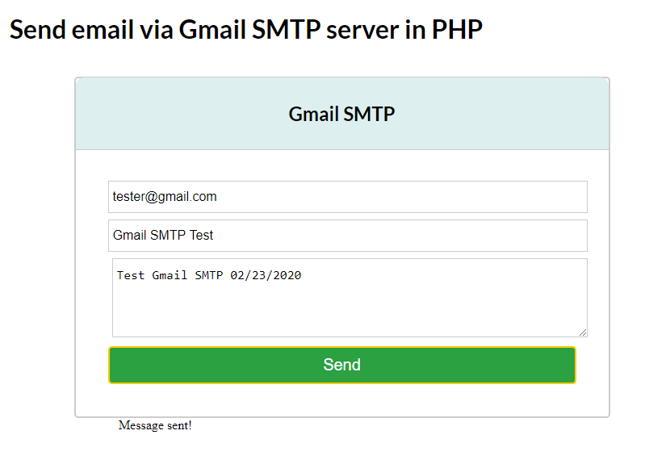
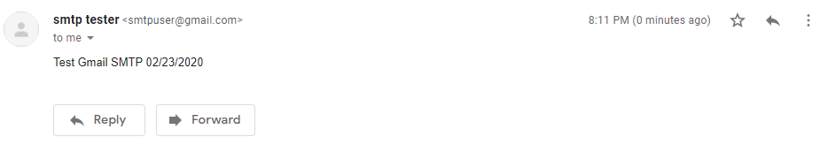

"# gmailsmtp-phpmailer" 

# Send email via Gmail SMTP server in PHP
Google SMTP Server – How to Send Emails for Free
Google's Gmail SMTP server is a free SMTP service which anyone who has a Gmail account can use to send emails. You can use it with personal emails, or even with your website if you are sending emails for things such as contact forms, newsletter blasts, or notifications.

## Installation & loading
PHPMailer is available on [Packagist](https://packagist.org/packages/phpmailer/phpmailer) (using semantic versioning), and installation via [Composer](https://getcomposer.org) is the recommended way to install PHPMailer. Just add this line to your `composer.json` file:

```json
"phpmailer/phpmailer": "~6.1"
```

or run

```sh
composer require phpmailer/phpmailer
```

## Gmail SMTP settings
To use Gmail's SMTP server, you will need the following settings for your outgoing emails:

- Outgoing Mail (SMTP) Server: smtp.gmail.com
- Use Authentication: Yes
- Use Secure Connection: Yes (TLS or SSL depending on your mail client/website SMTP plugin)
- Username: your Gmail account (e.g. user@gmail.com)
- Password: your Gmail password
- Port: 465 (SSL required) or 587 (TLS required)

## Screenshots

__Form screen__
<p align="center">
    
</p>

__Email screen__
<p align="center">
    
</p>

## Possible Errors And Exceptions
When you try to send email in your local environment, there might be this kind of problem.

### Antivirus software
You need to properly configure your antivirus software to exclude blocking mails sent to smtp.gmail.com.

mail works only while deactivating avast

```
1. Open Avast
2. Click on 'Settings' (upper right corner of page)
3. Click on 'Troubleshooting'
4. Click on 'Redirect Settings'
5. Clear all the port #'s from each field
6. Check 'Ignore Local Communication'
7. Click 'OK'
8. Close Avast
```

### SMTP Server Error: 5.5.1 Authentication Required. Learn More At 530 5.5.1
```
SMTP server error: 5.5.1 Authentication Required. Learn more at 530 5.5.1 
```
If you have encountered this error, then this is mostly because you have enabled 2FA on your Gmail account or you have not enabled access to Less Secure App. Read the above prerequisites to address this problem.

### Message: Fsockopen(): Unable To Connect To Ssl://Smtp.Gmail.Com
```
Message: fsockopen(): unable to connect to ssl://smtp.gmail.com:25 (A connection attempt failed because the connected party did not properly respond after a period of time, or established connection failed because connected host has failed to respond. )
```
If you have encountered this error, then this is mostly because of SSL issue. You need to enable SSL in php.ini file of your server configuration. In case you are using a XAMPP server, then please check whether it is enabled or not. You will get that in PHP info.
